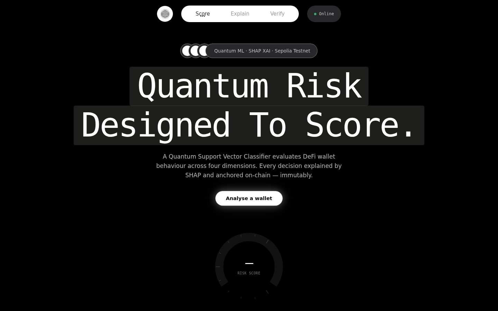
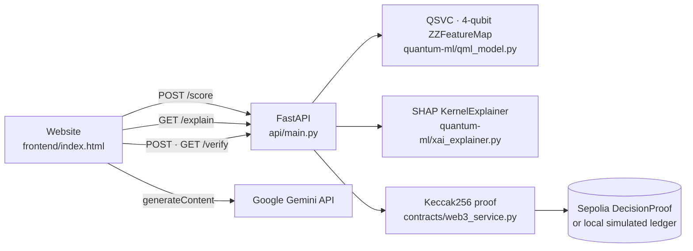
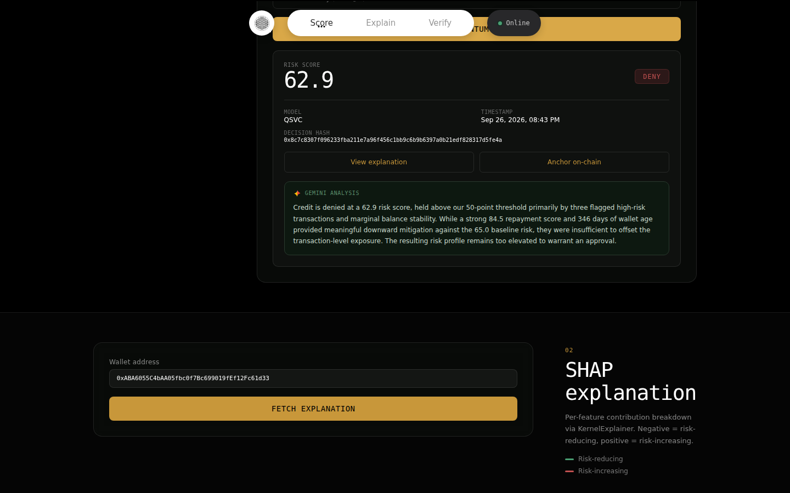
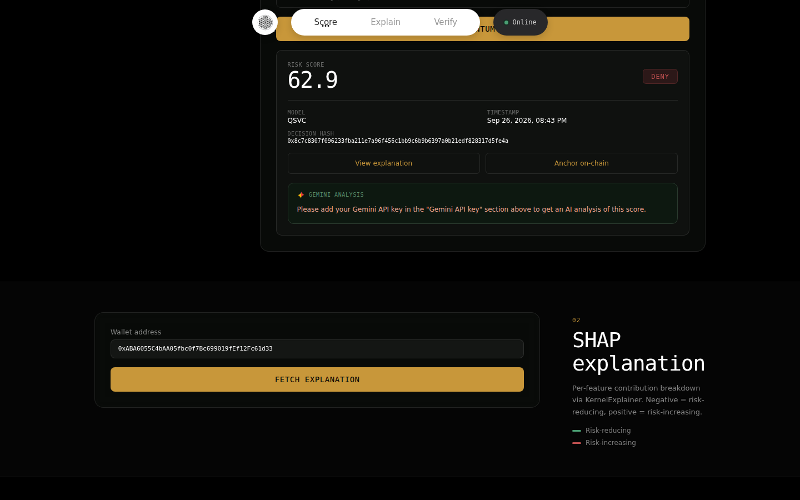
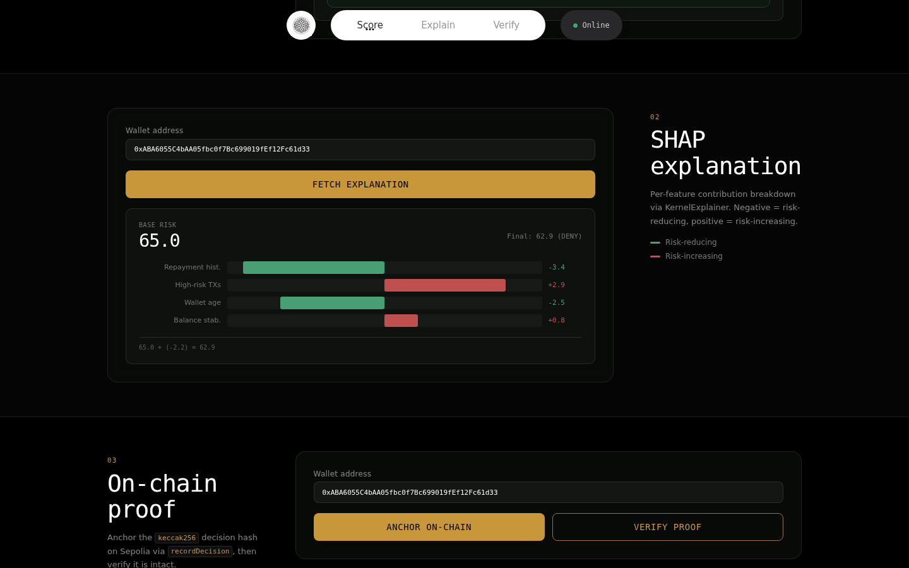
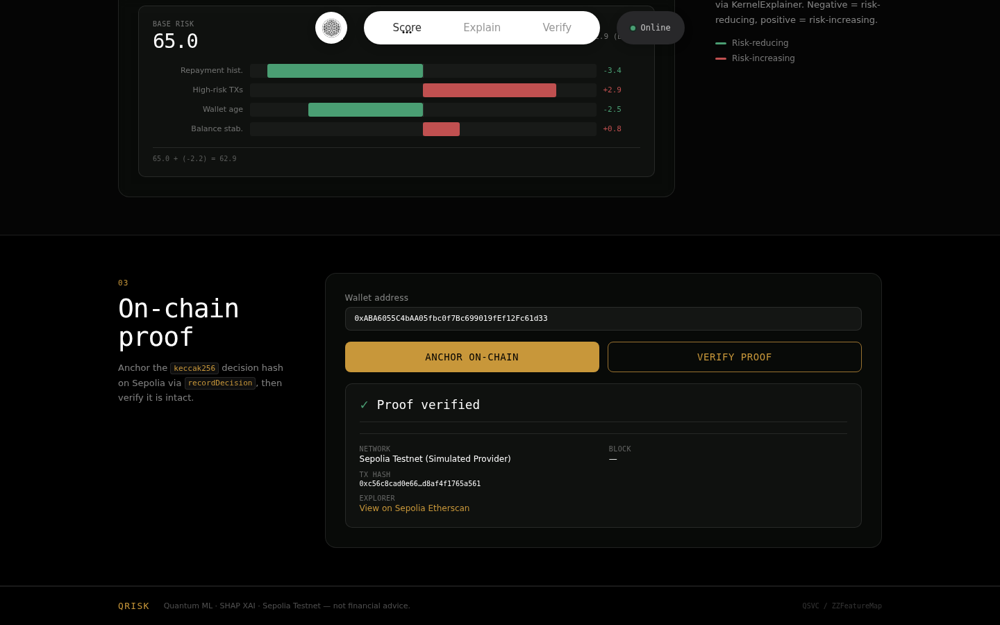

# Quantum Risk: DeFi Risk Checker

**Quantum Risk** scores DeFi wallets for credit risk with a **quantum machine-learning model**, explains every decision with **SHAP**, summarises it in plain English with **Google Gemini**, and anchors a **Keccak256 proof of the decision on the blockchain** (Ethereum Sepolia, or a built-in simulator).



---

## Contents

1. [What it does](#what-it-does)
2. [How it works](#how-it-works)
3. [Run it on your machine](#run-it-on-your-machine)
4. [Using the website](#using-the-website)
5. [Project structure](#project-structure)
6. [API reference](#api-reference)
7. [Configuration](#configuration)
8. [Troubleshooting](#troubleshooting)

---

## What it does

| Step | What happens | Where |
|---|---|---|
| **1. Score** | A Quantum Support Vector Classifier (QSVC) reads four wallet features and returns a risk score from 0 to 100. Below 50 is **APPROVE**; 50 or above is **DENY**. | `quantum-ml/qml_model.py` |
| **2. Explain** | SHAP (`KernelExplainer`) measures how many risk points each feature added or removed. | `quantum-ml/xai_explainer.py` |
| **3. Summarise** | Gemini turns the score and SHAP values into a 2–3 sentence analyst summary. This needs your own Gemini API key; without one, the site asks for it. | `frontend/app.js` |
| **4. Prove** | The decision is hashed with Keccak256 and written to the `DecisionProof` smart contract, or to a local simulated chain. It can be read back and verified at any time. | `contracts/` |

The four features the model reads:

| Feature | Meaning | Range |
|---|---|---|
| `repayment_history_score` | How reliably the wallet repaid past loans | 0–100 |
| `high_risk_tx_count` | Interactions with mixers or high-risk protocols | 0–30 |
| `wallet_age_days` | Days since the wallet was first active on-chain | 7–1500 |
| `balance_stability_score` | How stable the wallet's balance is | 0–100 |

---

## How it works



- **Quantum model:** Qiskit Machine Learning `QSVC` with a 4-qubit `ZZFeatureMap` (reps=1, linear entanglement) and a `FidelityQuantumKernel` on the Aer statevector simulator. It is pre-trained, and the artifacts ship in `quantum-ml/artifacts/`, so nothing needs training before first use.
- **Explanations:** `shap.KernelExplainer` treats the quantum model as a black box. Results are cached in `data/cached_explanations.json` for fast responses.
- **Proof of decision:** the wallet, score and SHAP attributions are hashed with Keccak256. With Sepolia credentials in `.env`, the hash is written by `recordDecision(bytes32)` in `contracts/DecisionProof.sol`. Without them, a local ledger (`data/local_ledger.json`) simulates the chain with the same hashing, so the demo works offline.
- **Website:** plain HTML, CSS and JavaScript, with no build step. It calls the API at `http://localhost:8000` and calls Gemini directly from your browser with the key you enter.

---

## Run it on your machine

You need two terminals: one for the backend API and one to serve the website.

### Prerequisites

- **Python 3.11** (tested with 3.11.15). Check with `python3 --version`. Python 3.10 may work, but 3.12+ is not supported by some pinned packages.
- **git**
- A modern browser (Chrome, Edge, Firefox or Safari)
- An internet connection. The site loads its fonts and hero background video from CDNs, and Gemini is an online API. Scoring, SHAP and proofs run locally.
- Optional: a **Gemini API key** for the AI summary. Get one free at <https://aistudio.google.com/apikey>.

### 1. Get the code

```bash
git clone https://github.com/himeshsoni704/Defi-risk-checker.git
cd Defi-risk-checker
```

### 2. Create a virtual environment and install dependencies

macOS / Linux:

```bash
python3 -m venv .venv
source .venv/bin/activate
pip install --upgrade pip
pip install -r requirements.txt
```

Windows (PowerShell):

```powershell
py -3.11 -m venv .venv
.venv\Scripts\Activate.ps1
python -m pip install --upgrade pip
pip install -r requirements.txt
```

The install downloads Qiskit, SHAP and web3, and takes a few minutes the first time.

### 3. (Optional) Create your `.env`

The app runs without any configuration, using the simulated chain. To use live Sepolia later, copy the template:

```bash
cp .env.example .env        # Windows: copy .env.example .env
```

### 4. Start the backend (terminal 1)

From the repository root, with the virtual environment active:

```bash
uvicorn api.main:app --host 0.0.0.0 --port 8000
```

Wait for `Application startup complete.` Then check it at <http://localhost:8000/health>. You should see `"status":"healthy"`. Interactive API docs are at <http://localhost:8000/docs>.

### 5. Serve the website (terminal 2)

```bash
cd frontend
python3 -m http.server 5500      # Windows: python -m http.server 5500
```

Open **<http://localhost:5500>** in your browser. The status pill in the top bar should read **Online**.

> The website must be able to reach the API at `http://localhost:8000`. If you change the backend port, update `const API` at the top of `frontend/app.js`.

### 6. (Optional) Run the end-to-end test suite

In a third terminal, from the repository root with the virtual environment active:

```bash
python test_pipeline.py
```

It runs the whole pipeline in-process in seven steps: health, sample wallets, scoring with explicit features, scoring by address, SHAP, on-chain write and on-chain verify. It ends with `ALL 7 END-TO-END PIPELINE TESTS PASSED`.

---

## Using the website

### 1. Score a wallet

Pick a pre-loaded wallet from **Sample wallets**, or paste any `0x…` address, then press **Run quantum score**. Open **Custom features** to try your own values for the four features.

To get the Gemini summary, open **Gemini API key** and paste your key before scoring. The key is stored only in your browser's `localStorage` and is sent only to Google.



Without a key, the site asks you for one instead of showing an analysis:



### 2. See why: SHAP explanation

Press **View explanation**, then **Fetch explanation**. Each bar shows how many risk points a feature added (pushes towards DENY) or removed (pushes towards APPROVE), relative to the model's base risk value.



### 3. Prove it: anchor and verify on-chain

Press **Anchor on-chain** to hash the decision and record it, then **Verify proof** to read it back and compare. A match shows **Proof verified**, with the network, transaction hash and explorer link. The block number is shown right after anchoring.



### API docs

Every endpoint can also be tried directly from Swagger UI at <http://localhost:8000/docs>.

---

## Project structure

```
Defi-risk-checker/
├── frontend/                    # The website (no build step)
│   ├── index.html               #   Page layout: hero, score, explain, verify
│   ├── app.js                   #   API calls, Gemini call, gauges and charts
│   ├── style.css                #   Styling
│   └── logo.webp
├── api/
│   ├── main.py                  # FastAPI app and routes
│   ├── service.py               # Orchestrates model, SHAP and Web3
│   └── models.py                # Request/response schemas
├── quantum-ml/
│   ├── dataset.py               # Synthetic wallet generator (300 wallets)
│   ├── qml_model.py             # QSVC definition, training, inference
│   ├── xai_explainer.py         # SHAP KernelExplainer + cache
│   └── artifacts/               # Pre-trained model, scaler, metadata
├── contracts/
│   ├── DecisionProof.sol        # Solidity proof-of-decision contract
│   ├── deploy.py                # Compile and deploy to Sepolia
│   ├── web3_service.py          # Keccak256 hashing, on-chain read/write
│   └── artifacts/DecisionProof.json
├── data/                        # Dataset, SHAP cache, decisions, local ledger
├── docs/images/                 # Screenshots used in this README
├── test_pipeline.py             # End-to-end test suite
├── API_CONTRACT.md              # Full request/response schemas
├── FRONTEND_README.md           # Frontend integration notes
├── requirements.txt
└── .env.example
```

---

## API reference

Base URL: `http://localhost:8000`

| Method | Endpoint | Description |
|---|---|---|
| `GET` | `/health` | API status, model metrics, blockchain mode |
| `GET` | `/wallets?limit=10` | Sample wallets from the dataset |
| `POST` | `/score` | Risk score (0–100) and APPROVE/DENY decision |
| `GET` | `/explain/{wallet}` | SHAP contribution per feature |
| `POST` | `/verify/{wallet}` | Anchor the decision hash on-chain |
| `GET` | `/verify/{wallet}` | Read the hash back and verify it |

Example:

```bash
curl -X POST http://localhost:8000/score \
  -H "Content-Type: application/json" \
  -d '{"wallet_address": "0xABA6055C4bAA05fbc0f7Bc699019fEf12Fc61d33"}'
```

Full schemas are in [`API_CONTRACT.md`](./API_CONTRACT.md).

---

## Configuration

All settings are optional and live in `.env` (copy it from `.env.example`).

| Variable | Default | Purpose |
|---|---|---|
| `SEPOLIA_RPC_URL` | `https://rpc.sepolia.org` | Sepolia RPC endpoint |
| `PRIVATE_KEY` | *(empty)* | Funded Sepolia key that signs proof transactions |
| `CONTRACT_ADDRESS` | *(empty)* | Deployed `DecisionProof` address |
| `EXPLORER_BASE_URL` | `https://sepolia.etherscan.io` | Explorer used for transaction links |

While `PRIVATE_KEY` or `CONTRACT_ADDRESS` is empty, proofs use the **simulated provider**: same hashing, stored in `data/local_ledger.json`.

**Anchoring on live Sepolia:**

1. Put a funded Sepolia key in `PRIVATE_KEY`.
2. Run `python contracts/deploy.py`.
3. Copy the printed address into `CONTRACT_ADDRESS`.
4. Restart the API.

**Gemini** is configured in the browser, not in `.env`: paste the key into the site's **Gemini API key** field. The site uses `gemini-3.8-flash`, with `gemini-3.5-flash-lite` as a backup model.

**Retraining (optional):** the dataset and model are pre-built. To regenerate them, run `python quantum-ml/dataset.py`, then `python quantum-ml/qml_model.py`.

---

## Troubleshooting

| Symptom | Fix |
|---|---|
| Status pill says **Offline**, or "Failed. Is the backend running?" | Start the API (step 4) and check <http://localhost:8000/health>. The API must be on port 8000. |
| "Please add your Gemini API key…" | Open **Gemini API key** above the score button, paste your key, and score again. |
| "Gemini analysis unavailable (…)" | The key was rejected or Gemini is busy. Check the key at <https://aistudio.google.com/apikey> and retry. |
| `pip install` fails on Qiskit or numpy | Use Python 3.11 (`python3 --version`), then recreate the virtual environment. |
| `Address already in use` | Something else is using the port. Stop it, or use another port, updating `const API` in `frontend/app.js` if it's the API port. |
| Opening `index.html` by double-click doesn't load data | Serve it with `python3 -m http.server 5500` as in step 5 and use <http://localhost:5500>. |

---

Built with Qiskit Machine Learning, SHAP, FastAPI, web3.py, Solidity and Google Gemini. The dataset is synthetic; scores are for demonstration and are not financial advice.
